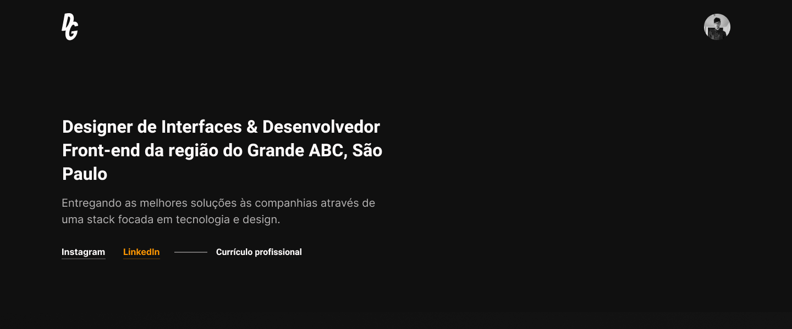
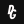

<p align="center">
  
  
  
  
</p>

## **:book: Summary**

- [About this project](#-about-the-project)
- [Principle libraries](#-principle-libraries)
- [Prerequisites](#warning-prerequisites)


## ** About the project**

A website beta test raised to expose all my recent Design and Code projects through an interface created in ReactJS while I'm aprimoring my knowleadges in Next.js and GatsbyJS.


## ** Principle libraries**

- **axios:** v0.19.2
- **normalize.css:** v8.0.1
- **react-loadable:** v5.5.0
- **styled-components:** v5.1.1
- **styled-media-query:** v2.1.2
- **typescript:** v3.7.2
- **use-media:** v1.4.0


## **:warning: Prerequisites**

- <a href="https://nodejs.org/en/" target="_blank">NodeJS</a>
- <a href="https://yarnpkg.com/" target="_blank">YarnPKG</a> or <a href="https://www.npmjs.com/" target="_blank">NPM</a>


### Running the application locally

```bash
  # Clonning the repository
  git clone https://github.com/dgbragas/dgbragas.netlify

  # Entering in the cloned folder
  cd dgbragas.netlify

  # Installing project dependencies (you can also use 'npm install')
  yarn

  # Running the application (it will run at http://localhost:3000)
  yarn install
```

---

*Develop by @dgbragas*
